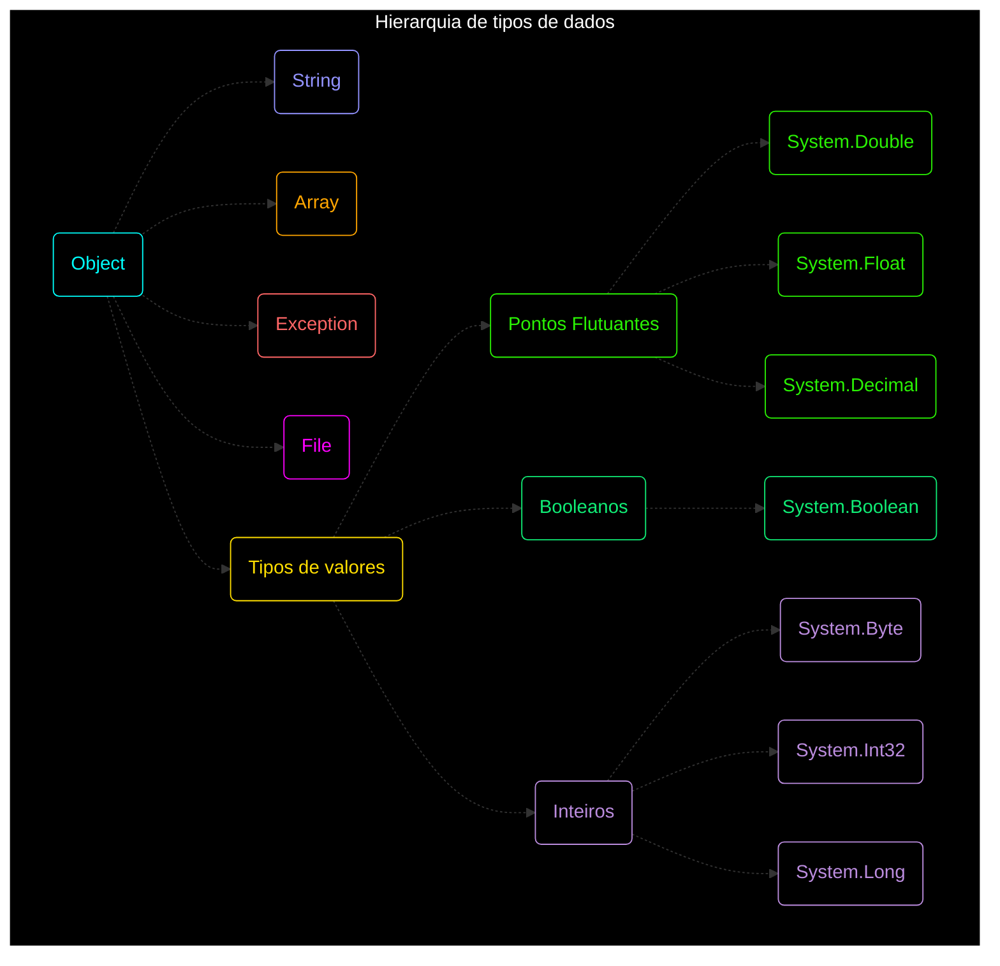

## Página inicial sobre os tipos de dados

1 - [[Primitivos]]
2 - [[Conversões]]

## Hierarquia dos tipos de dados

```mermaid
flowchart 
	subgraph subg [Hierarquia de tipos de dados]
		obj(Object) .-> str(String)
		obj .-> array(Array)
		obj .-> exp(Exception)
		obj .-> file(File)
		obj .-> value(Tipos de valores)
		value .-> flut(Pontos Flutuantes)
		value .-> bool(Booleanos)
		value .-> inte(Inteiros)
		flut .-> double(System.Double)
		inte .-> byte(System.Byte)
		flut .-> float(System.Float)
		flut .-> decimal(System.Decimal)
		inte .-> int32(System.Int32)
		inte .-> long(System.Long)
		bool .-> boolean(System.Boolean)
	end
	style subg fill:#000,color:#fff,stroke:#fff
	style obj fill:#000,color:#00fffc,stroke:#00fffc
	style exp fill:#000,color:#FF6666,stroke:#FF6666
	style str fill:#000,color:#9393FF,stroke:#9393FF
	style array fill:#000,color:#FFA500,stroke:#FFA500
	style file fill:#000,color:#FF00FF,stroke:#FF00FF
	style value fill:#000,color:#ffde00,stroke:#ffde00
	style flut fill:#000,color:#2af104,stroke:#2af104
	style double fill:#000,color:#2af104,stroke:#2af104
	style float fill:#000,color:#2af104,stroke:#2af104
	style decimal fill:#000,color:#2af104,stroke:#2af104
	style inte fill:#000,color:#bb8cde,stroke:#bb8cde
	style byte fill:#000,color:#bb8cde,stroke:#bb8cde
	style int32 fill:#000,color:#bb8cde,stroke:#bb8cde
	style long fill:#000,color:#bb8cde,stroke:#bb8cde
	style bool fill:#000,color:#10ec75,stroke:#10ec75
	style boolean fill:#000,color:#10ec75,stroke:#10ec75

```
